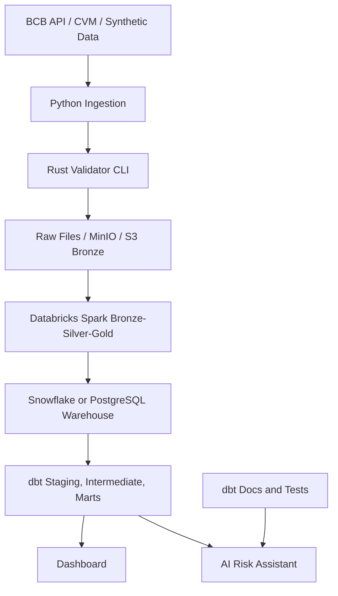

# Architecture diagram

```mermaid
flowchart TD
    A[BCB API / CVM / Synthetic Data] --> B[Python Ingestion]
    B --> C[Rust Validator CLI]
    C --> D[Raw Files / MinIO / S3 Bronze]
    D --> E[Databricks Spark Bronze-Silver-Gold]
    E --> F[Snowflake or PostgreSQL Warehouse]
    F --> G[dbt Staging, Intermediate, Marts]
    G --> H[Dashboard]
    G --> I[AI Risk Assistant]
    J[dbt Docs and Tests] --> I
```
