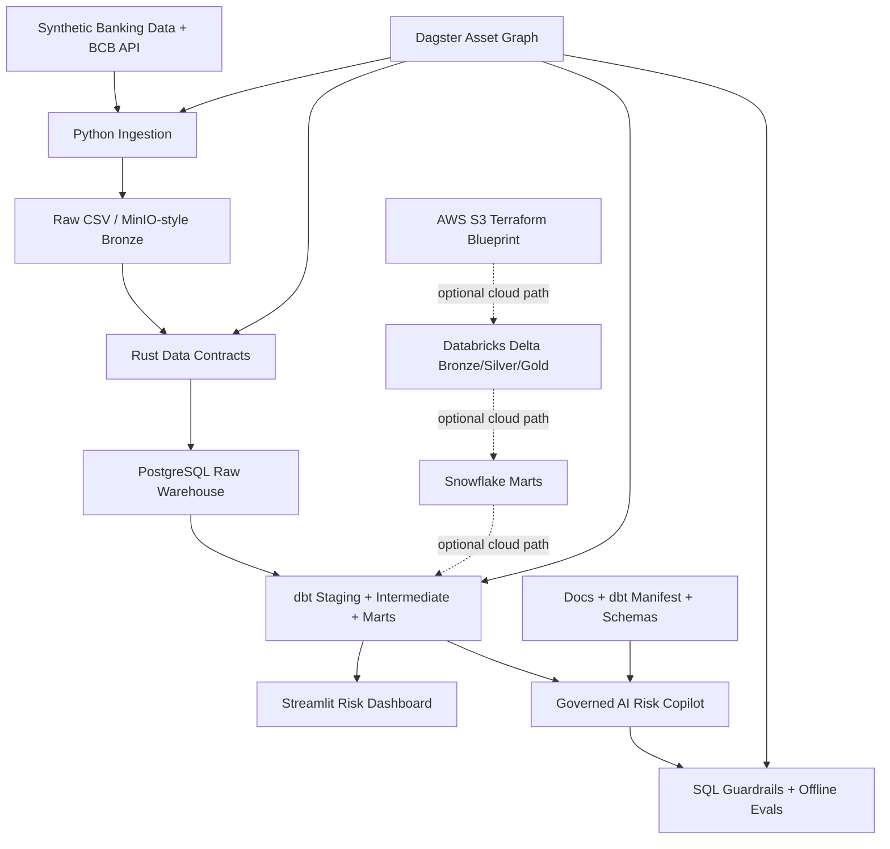

# Architecture diagram

```mermaid
flowchart TD
    A[Synthetic Banking Data + BCB API] --> B[Python Ingestion]
    B --> C[Raw CSV / MinIO-style Bronze]
    C --> D[Rust Data Contracts]
    D --> E[PostgreSQL Raw Warehouse]
    E --> F[dbt Staging + Intermediate + Marts]
    F --> G[Streamlit Risk Dashboard]
    F --> H[Governed AI Risk Copilot]
    I[Docs + dbt Manifest + Schemas] --> H
    H --> J[SQL Guardrails + Offline Evals]
    K[AWS S3 Terraform Blueprint] -. optional cloud path .-> L[Databricks Delta Bronze/Silver/Gold]
    L -. optional cloud path .-> M[Snowflake Marts]
    M -. optional cloud path .-> F
    N[Dagster Asset Graph] --> B
    N --> D
    N --> F
    N --> J
```
