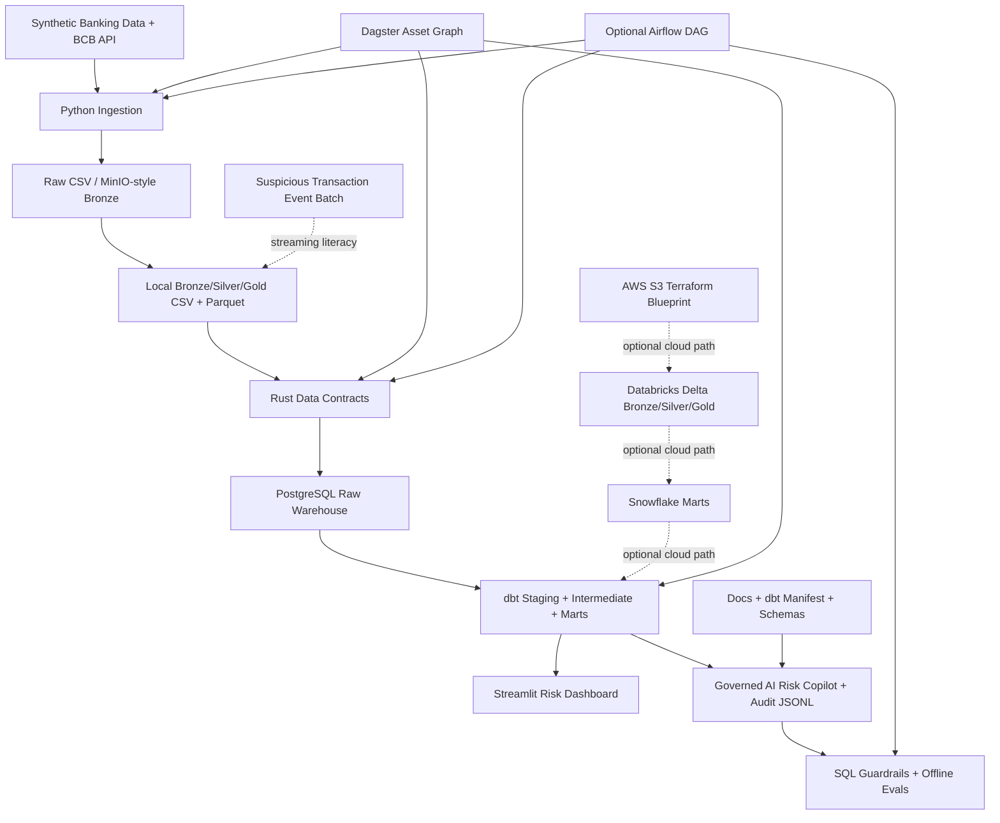

# Architecture diagram

```mermaid
flowchart TD
    A[Synthetic Banking Data + BCB API] --> B[Python Ingestion]
    B --> C[Raw CSV / MinIO-style Bronze]
    C --> D[Local Bronze/Silver/Gold CSV + Parquet]
    D --> E[Rust Data Contracts]
    E --> F[PostgreSQL Raw Warehouse]
    F --> G[dbt Staging + Intermediate + Marts]
    G --> H[Streamlit Risk Dashboard]
    G --> I[Governed AI Risk Copilot + Audit JSONL]
    J[Docs + dbt Manifest + Schemas] --> I
    I --> K[SQL Guardrails + Offline Evals]
    L[Suspicious Transaction Event Batch] -. streaming literacy .-> D
    M[AWS S3 Terraform Blueprint] -. optional cloud path .-> N[Databricks Delta Bronze/Silver/Gold]
    N -. optional cloud path .-> O[Snowflake Marts]
    O -. optional cloud path .-> G
    P[Dagster Asset Graph] --> B
    Q[Optional Airflow DAG] --> B
    P --> E
    Q --> E
    P --> G
    Q --> K
```
